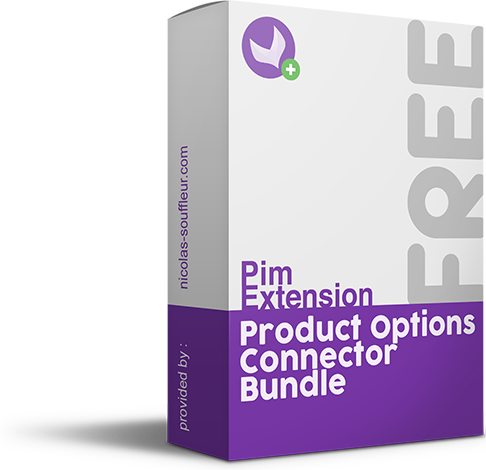

OptionImporterConnectorBundle
==========================

This new connector allows you to add the new attributes options to Akeneo automatically while importing products

## Requirements

| MappingConnectorBundle     | Akeneo PIM Community Edition | Akeneo PIM Enterprise Edition |
|:------------------------------:|:----------------------------:|:-----------------------------:|
| v1.0.*                         | v2.3.*                         | v2.3.*                              |

## Installation

Next, enter the following command line:
```console
$php composer.phar require "nicolas-souffleur/product-options-connector-bundle":"1.0.*"
```

Then enable the bundle in the ```app/AppKernel.php``` file in the registerProjectBundles() method:
```php
$bundles[] = new \Extensions\Bundle\OptionImporterConnectorBundle\ExtensionsOptionImporterConnectorBundle()
```

## Usage

It's easy, you only have to create a new import job.
Then select a default locale in your job's configuration to create automatically the first label of the attribute options.
To create the attribute option code the job will remove all the specific characters of the value and replace the spaces with an underscore.
It's ready, enjoy. 

## Roadmap
* [DONE] Select field with available locales in the job instance configuration
* Add a configuration field to choose which attribute to process
* Notify the user about the attribute options added

Don't hesitate to send me a message if you would like other features :)

## About me
Specialized in Akeneo since its launch in 2014, I'm helping companies to implement this efficient and essential solution, to integrate it into their workflow and to structure their data. Feel free to contact me through my contact form on my website (http://www.nicolas-souffleur.com) or directly by email (contact@nicolas-souffleur.com).

